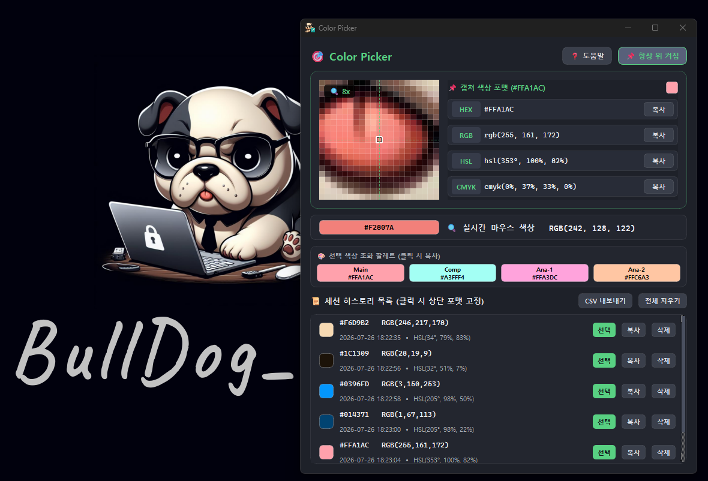

#  Color Picker

## 🚀 Overview

PySide6와 Win32 API 기반의 **정사각형 픽셀 돋보기 & 다중 포맷 컬러 픽커 유틸리티**입니다.  
어떤 화면 위에서든 마우스 클릭(`Ctrl+클릭`)과 단축키(`Ctrl+C`)를 통해 1px 단위 색상을 8배 정사각형 돋보기로 조준 및 캡쳐하고, HEX·RGB·HSL·CMYK 포맷으로 복사할 수 있습니다.

## 🛠️ Built With

<picture>
  <source media="(prefers-color-scheme: dark)" srcset=".github/readme/badges/dark/windows.png">
  <source media="(prefers-color-scheme: light)" srcset=".github/readme/badges/light/windows.png">
  
</picture>
<picture>
  <source media="(prefers-color-scheme: dark)" srcset=".github/readme/badges/dark/python.png">
  <source media="(prefers-color-scheme: light)" srcset=".github/readme/badges/light/python.png">
  
</picture>
<picture>
  <source media="(prefers-color-scheme: dark)" srcset=".github/readme/badges/dark/pyside6.png">
  <source media="(prefers-color-scheme: light)" srcset=".github/readme/badges/light/pyside6.png">
  
</picture>
<picture>
  <source media="(prefers-color-scheme: dark)" srcset=".github/readme/badges/dark/pyinstaller.png">
  <source media="(prefers-color-scheme: light)" srcset=".github/readme/badges/light/pyinstaller.png">
  
</picture>

## 🖥️ Preview

<p align="center">
  
</p>

## ✨ Key Features

- **🔍 정사각형 돋보기 & 십자선**: 1px 미세 조준을 위한 200x200 8배 고정 정밀 확대 캔버스 및 십자선 제공.
- **📌 포맷 고정 & 복사**: 마우스 이동 간섭 없는 캡쳐 색상 고정 및 포맷별(HEX/RGB/HSL/CMYK) 복사.
- **🎨 색상 조화 추천**: 선택 색상의 보색 및 유사색 팔레트 자동 계산 및 원클릭 복사.
- **📋 토스트 알림**: 클립보드 복사 성공 시 즉시 플로팅 알림 팝업 제공.
- **📌 항상 위 & 트레이**: 창 상단 고정 및 최소화 시 백그라운드 트레이 상주.
- **💾 세션 보존 & CSV 내보내기**: 세션 자동 복원 및 한글 CSV 파일 내보내기.
- **❓ 도움말 가이드**: 뱃지 스타일의 단축키 안내 다이얼로그 제공.

## 📂 Project Structure

```text
ColorPicker/
┣━━ 📂 .github/                # README 이미지 및 뱃지 자산 (logo, preview, badges)
┣━━ 📂 assets/                 # 아이콘, Pretendard 폰트 및 세션 저장소 (session_history.json)
┣━━ 📄 ColorPickerApp.py       # 프로그램 진입점 및 전역 단축키 훅
┣━━ 📄 ColorPickerCore.py      # Win32 API (ctypes) & 색상 포맷 변환 로직
┣━━ 📄 ColorPickerUi.py        # PySide6 메인 윈도우, 돋보기 & 포맷 카드 UI
┣━━ 📄 build.bat               # Executable 자동 빌드 스크립트
┣━━ 📄 requirements.txt        # 필수 의존성 목록 (PySide6, pynput, Pillow 등)
┣━━ 📄 .gitignore              # Git 제외 파일 설정
┗━━ 📄 README.md               # 프로젝트 설명 문서
```

## ⚙️ Getting Started

### 📋 Prerequisites (사전 요구사항)
- **OS**: Windows 10 / 11 (Win32 API 전역 단축키 훅 지원)
- **Python**: Python 3.9+ 권장

### 1. 소스 코드 직접 실행 (Run from Source)

```bash
# 1. 저장소 클론
git clone https://github.com/Hyeonseok93/MINI_ColorPicker.git
cd MINI_ColorPicker

# 2. 가상 환경 생성 및 활성화 (권장)
py -3 -m venv .venv
.venv\Scripts\activate

# 3. 필수 의존성 설치
pip install -r requirements.txt

# 4. 애플리케이션 실행
python ColorPickerApp.py
```

### 2. 포터블 실행 파일(.exe) 빌드 (Build Portable Executable)

프로젝트 루트의 `build.bat`을 실행하면 가상 환경(`.venv`) 생성, 의존성 설치, 빌드 및 임시 폴더 정리를 거쳐 `ColorPicker.exe` 단일 포터블 실행 파일을 생성합니다.

```cmd
build.bat
```

> 💡 빌드가 완료되면 생성된 **`ColorPicker.exe`** 파일만 추출하여 무설치 포터블로 사용할 수 있습니다.

## 📄 License

This project is licensed under the MIT License.
